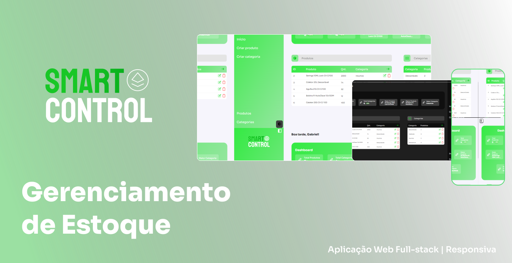

<div align="center">
  
</div>

<hr>
<br>

# Funcionalidades
- Listagem, cadastro, atualização e remoção de produtos
- Listagem, cadastro, atualização e remoção de categorias de produtos
- Dashboards com indicadores

# Tecnologias utilizadas

## Front-end
- React.js
- Styled-Components

## Back-end
- NodeJS
- PostgreSQL
- API REST

# Como executar
Antes de tudo, na sua máquina deverá ter:
- Node.js
- Docker
- Git

Será necessário instalar as dependências do projeto back-end que está no diretório `/api`, executá-lo, e então depois instalar e executar as dependências do front-end que se encontra no diretório `/fe`.

## Executando o back-end
```bash
$ git clone https://github.com/igabrielvieira/smartcontrol

$ cd smartcontrol/api

$ docker compose up -d

$ docker ps

$ docker start api-db-1 (caso o container não apareça no comando acima)

$ yarn dev

```

## Executando o front-end
```bash
$ cd smartcontrol/fe

$ npm install # ou yarn install

$ yarn start

```
